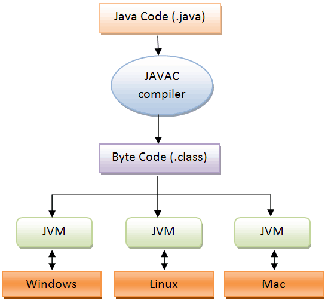

# 20211221

작성일시: 2021년 12월 21일 오전 9:35

# 오늘 배운것

- **JVM(JAVA Virtual Machine)**
    
    
    
    - 자바 가상 머신이라 부른다.
    - 자바와 운영체제 사이에서 중계자 역할을 한다.
    - **자바가 운영체제 종류에 영향을 받지 않고  동작 할 수 있게 한다.**
    - **메모리 관리를 알아서 해준다.(Garbage Collector)**
- **JVM 메모리**
    
    
    
    - JVM 메모리는 세분화하면 6가지(Method, Runtime Constant Pool, Heap,  PC Register, Native Method Stack) 영역으로 나눌 수 있다.
        - **Method(Static)**: JVM에서 읽어들인 **클래스와 인터페이스에 대한 런타임 상수 풀**, **메서드**와 필드 , **static** 변수, **메서드 바이트 코드** 등을 보관한다.
            - Method와 RuntimeConstant 영역에 저장된 데이터는 JVM 시작부터 종료까지 생존한다.
        - **RuntimeConstantPool:** JVM 런타임 상수 풀을 통해 해당 메서드나 필드의  실제  메모리상 주소를 찾아 참조. 클래스와 필드에 대한 모든 레퍼런스 저장.
        - **Heap**: 프로그램에서 데이터를 저장하기 위해 런타임시 동적으로 할당하여 사용하는 메모리 영역으로 new를 이용해 생성한 객체  또는 인스턴스를 저장.
        - **stack**: 메서드 호출 시 생성되는 스레드 수행정보를 기록하는 frame 저장, 메서드 정보, 지역정보, 매개변수, 연산에 의해 발생하는 임시 데이터를 저장.
        - **PC 레지스터**: 현재 실행중인 JVM 주소를 가짐. CPU instruction을 수행하는 동안 필요한 정보를  CPU내 기억장치인 레지스터에 저장한다. 연산 및 결과 값을 메모리에 전달하기 전 CPU내 기억장치이다.
        - **Native Method Stack**: 자바 외 언어로 작성된 네이티브 코드를 위한 메모리(c/c++)
- **static** : static을 사용한다는 것은 메모리에 한번 할당되어 프로그램이 종료 될 때 해체되는 것을 의미한다. (일반적으로 지역변수와 반대 개념이라 생각하면 된다.
    - static은 Method(static) 영역 메모리에 저장된다.
    - 미리 메모리에 올라가 있기 때문에 인스턴스 생성 없이 바로 사용 가능하다.
    - 미리 생성된 메모리에서 참조하면 되기 때문에 메모리를 절약 할 수있다.
    - GC의 영향을 받지 않기 때문에 남용 할 경우 메모리 누수 위험이 있다.
        - 메모리 누수(Memory leak): 컴퓨터 과학에서 메모리 누수 현상이란 컴퓨터 프로그램이 필요하지 않은 메모리를 계속해서 점유하고 있는 현상이다.
- **싱글톤 패턴:**  객체의 인스턴스가 오직 하나만 생성되는 패턴
    - 생성자가 여러개 호출 되더라도 **실제로 생성되는 객체는 하나**이고 최초 생성 이후에 호출된 생성자는 **최초의 생성자가 생성한 객체를 리턴**한다.
    - 실제로 생성되는 객체는 하나이기 때문에 메모리 측면에서 효율적이다.
    - 다른 클래스간 공유가 쉽다. 싱근톤 인스턴스가 전역으로 사용되기 때문이다
        - 동시에 단점으로 지적된다. 여러 클래스 데이터에 동시에 접근하기 때문에 동시성 문제가 발생 할 수 있기 때문이다.(서로간의 결합도가 커진다.)
    - 도메인 관점에서 인스턴스가 한 개만 존재하는 것은 보증하고 싶을 때도 싱글턴 패턴을 사용한다.

# 오늘 느낀점

- static은 전역변수처럼 사용 가능하다. 그러나 프로그램 종료까지 변수가 살아있기 때문에 항상 유의하면서 사용해야겠다는 생각이 들었다.
- 싱글톤 패턴은 여러번 호출하더라도 실제로 생성되는 객체는 하나인 패턴이다. 그러나 종속성의 문제가 있다고 하는데 멀티쓰레드를 사용 할 경우 동기화를 못해준다면 문제가 발생 할 수 있다고 생각했다.

# 참고 사이트

[Static variable - Wikipedia](https://en.wikipedia.org/wiki/Static_variable)

[JAVA Static변수와 메모리 구조](https://velog.io/@yonii/JAVA-Static%EC%9D%B4%EB%9E%80)

[[Java] JVM 메모리 구조](https://limkydev.tistory.com/51)

[싱글톤(Singleton) 패턴이란?](https://tecoble.techcourse.co.kr/post/2020-11-07-singleton/)