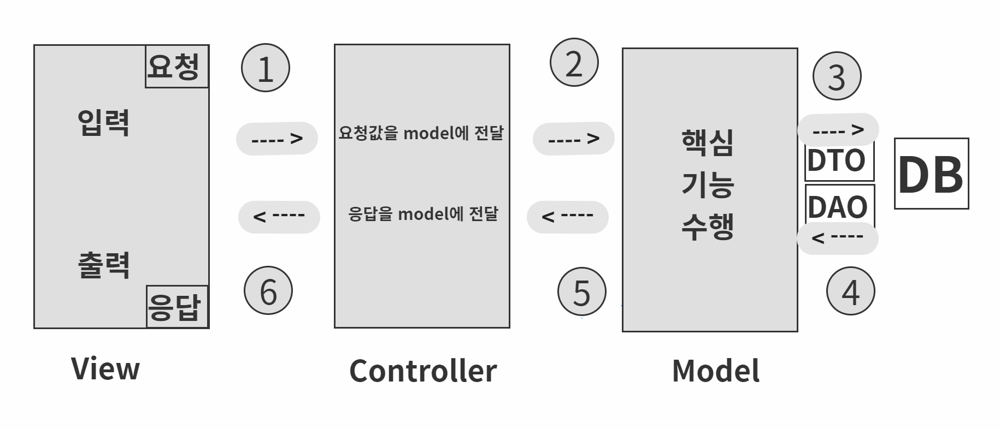

# 20211222

작성일시: 2021년 12월 22일 오후 8:15

# 오늘 배운 것

- **MVC 패턴**:  Model, View, Controller 3부분으로 코드를 나눠서 진행하는 패턴
    - Why?: 프로젝트가 커지면 코드 수정시 다른 코드를 모두 갈아 엎어버려야 할 때가 있다.  그래서 개발자들 사이에서 좀 더 효율적으로 유지보수 할 수 있는 패턴을 연구하게 되었고 그 중 하나가 MVC 패턴이다.
    - Model,: 데이터를 다룬다. 데이터와 관련된 중요한 핵심 업무 처리는 여기서 처리하고 View와 Controller와는 독립적이여야한다.
        - Model이 DB와 데이터를 주고 받을 때는 **DAO, DTO**가 쓰인다.
        - **DAO: Data Access Object** 로 Model에서 DB 데이터를 인덱싱 할 때 쓰인다. DAO는 **CRUD**를 실행하는 객체이다.
            - CRUD: Create, Read, Update, Delete
        - **DTO: Data Transfer Object** 로 계층간 데이터 교환을 위해 사용하는 객체이다.  특별한 메서드는 존재하지 않고 객체의 속성과 속성 접근을 위한 getter, setter만 존재한다.
    - Controller: Model과 View를 이어주는 역할을 한다.
        - View에서 Model, Model에서 View로 연결된 로직으로 구성되어 있다.
    - View : 사용자에게 실제 보여주는 공간으로  입출력을 담당한다.

MVC 패턴 실행 과정

# 오늘 느낀점

- Controller에서 봤을 때 View에서 Model까지 한번에 이어지는 코드를 보니 한눈에 보기 쉬웠고 Error나 디버깅 하는 것도 그냥 막 짠 코드보다 훨씬 간단했다.
- 아쉽게도 자바만 공부했기 때문에 DB와 Spring을 이용한 방법은 아직 해보지 못했다. 그러나 MVC 패턴의 위력이  생각 보다 대단한 것을 체감했다. 빨리 DB와 Spring을 배워서 MVC 패턴을 구성해보고 싶다.
- 종속적이다. 의존적이다. 라는 느낌을 이번 실습을 통해 이해 할 수 있었다.  예를 들어 Model 클래스에는 View 또는 Controller 관련된 코드가 있으면 안된다.
