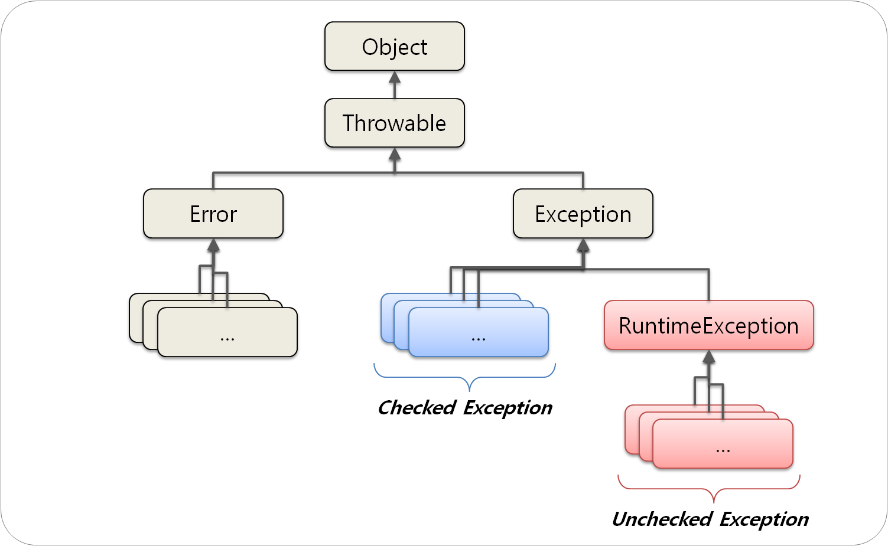

# 20211227

작성일시: 2021년 12월 27일 오후 9:44

# 오늘 배운것

- **예외 처리(Exception)** vs **오류(Error)**
    
    
    
    에러와 예외처리 구조
    
    - **오류(Error)** 란 **시스템에 비정상적인 상황**이 발생했을 때이다.
        - 오류는 시스템 레벨의 심각한 수준의 문제이기 때문에 개발자가 처리 할 수 없다.
    - **예외(Exception)**는 **개발자가 구현한 로직**에서 발생한다.
        - 예외는 개발자가 처리 가능하다.
        - **컴파일 단계**에서 발생하는 예외는 **Checked Exception** 이라 한다. 컴파일 단계에서 발생하는 예외이기 때문에 반드시 처리하지 않으면 프로그램을 실행 할 수 없다.
            - ex) **IOException**, **SQLException**
        - **런타임 단계**에서 발생하는 예외는 **UnChecked Exception**이라 한다. 런타임 단계에서 발생하는 예외이기 때문에 실행 전에는 모르지만 실행 후 런타임 중 발생하는 에러이다.
            - ex) **NullPointerException, IndexOutOfBoundException, SystemException** .......

- **Exception 처리과정(기본)**
    
    ```java
    try {
    			String str2 = "three";
    			Integer.parseInt(str2);
    			int x = 1 / 0;
    		} catch (Exception e) {
    			// TODO: handle exception
    			e.printStackTrace();
    			System.out.println("예외처리 부분");
    ```
    
    - 다음 예제와 같이 2개의 에러가 try에 존재하는 경우 Exception 클래스는 최상단 예외인 parseInt만 처리한다.
    
    ```java
    try {
    			String str2 = "three";
    			Integer.parseInt(str2);
    			
    			int x = 1/ 0;
    		} catch (NumberFormatException e) {
    			// TODO: handle exception
    			e.printStackTrace();
    			System.out.println();
    		} catch (Exception e) {
    			e.printStackTrace();
    			
    		}
    ```
    
    - Exception은 최상단을 처리하는데 윗부분 예외는 명시적으로 처리했으므로 처리 안한 아래 예외 중 최상단 예외를 처리한다.
    - 2개 다 명시적으로 예외처리도 가능하다.
    
- **사용자지정 예외처리**(기본)
    
    ```java
    public static void checkAdmin(String id) throws NotAdminException {
    		if(id.equals("admin")) {
    			System.out.println("관리자 계정으로 접속 실행");
    		} else {
    			throw new NotAdminException("관리자 계정으로 접속 실패");
    		}
    	}
    	
    	public static void main(String[] args) {
    		try {
    			checkAdmin("admn1");
    		} catch (NotAdminException e) {
    			// TODO Auto-generated catch block
    			e.printStackTrace();
    		}
    		
    	}
    ```
    
    ```java
    public class NotAdminException extends Exception{
    	public NotAdminException() {}
    	public NotAdminException(String msg) {
    		super(msg);
    		System.out.println(msg);
    	}
    }
    ```
    
    - 사용자지정 예외처리는 남용하면 안된다. 최대한 적게 사용해야 한다. 그렇지 않으면 나중 예외처리 할 때 매우 복잡 할 수 있다.
    - 사용자 지정 클래스는 extends를 이용해 Exception 클래스를 상속 받는다.
        - super(msg)와 같은 형태는 printStackTrace()에서 빨간글씨안에 예외출력을 가능하게 해준다.
    - 사용자 지정 예외처리 메서드를 작성할 때  메서드 이름 오른쪽에 throws 예외처리클래스 로 작성하고 블록에선 예외로 던질 부분을 throw new 예외처리클래스() 를 이용해 예외처리 객체를 호출한다.
    
- **인터페이스(Interface)**
    - 왜 쓰지?
        - 인터페이스를 사용하면 개발자들에게 어느정도 **정형화된 개발을 할 수 있도록** 할 수 있다.
        - **보수 할 때 교체하기가 쉽다.**
            
            ```java
            public interface Crypto {
              // 암호화
              public String encrypt(String str);
              // 복호화
              public String decrypt(String str);
            }
            ```
            
            ```java
            public class SHA512Crypto implements Crypto {
              @Override
              public String encrypt(String str) {
                // TODO: SHA512 방식으로 암호화
              }
              @Override
              public String decrypt(String str) {
                // TODO: SHA512 방식으로 복호화
              }
            }
            ```
            
            - 암호화 기능을 개발한다고 가정하면 암호의 핵심 기능인 암호화 그리고 암호 해독 기능일 것이다. 이를 Interface에서 정의하면  그것을 토대로 SHA512Crypto 를 설계하면 된다. 그러나 만약 SHA512 암호 방식이 더이상 안전하지 않아 다른 암호화 방식으로 바꾼다면 crypto 의 핵심기능인 암호화와 암호 해독기능은 그대로 가져오고 다른 클래스에서 상속받아 override 메서드를 작성해주면 된다.
                - Interface에서 로직 변경없이 상속받아 작성하면 되기 때문에 유지보수가 쉽고 명확해진다.
        - **다중 상속**
            - java에선 다중상속을 기본적으로 허용하지 않는다. 그러나 implements 에서 여러 인터페이스를 상속받아 사용 할 수 있다.
                - **기능을 분리, 결합하는데 효과적이다.**
                - 그러나 생각보다 복잡하고 로직 짜는 것이 쉽지 않다.
            

# 오늘 느낀점

- 예외처리는 중요한 부분 중 하나이다. 아직 스프링을 배우지 않았지만 스프링을 배울 때, 혹은 DB 처리 할 때 많이 사용한다고 한다.  지금은 기본만 배웠지만 어떻게 사용 할 지 궁금하다.
  
- 참고 블로그 저자처럼 예외처리는 **신뢰를 줄 수 있는 개발자**로 성장하는데 있어 중요한 개념인것 같다. 여러 아이디어와 화려한 기능도 물론 중요하지만 예외처리와 같은 탄탄한 개념이 뒷받침해야 프로그램을 더욱 안정적이고 단단하게 설계 할 수 있다고 생각한다.
  
- 인터페이스는 개념 자체는 간단하지만 응용이 매우 어려운 것 같다. Interface를 남용하거나 로직을 잘못 짜면 이해하기가 어려워지고 프로젝트도 복잡해진다. 인터페이스를 사용하는 여러가지 디자인 패턴이 있다는데 패턴을 공부하면 Interface의 기능을 좀 더 깊이 이해 할 수 있을 것 같다.

# 참고

[Java 예외(Exception) 처리에 대한 작은 생각](https://www.nextree.co.kr/p3239/)

[자바 인터페이스 사용 이유 (Java Interface)](https://gofnrk.tistory.com/22)