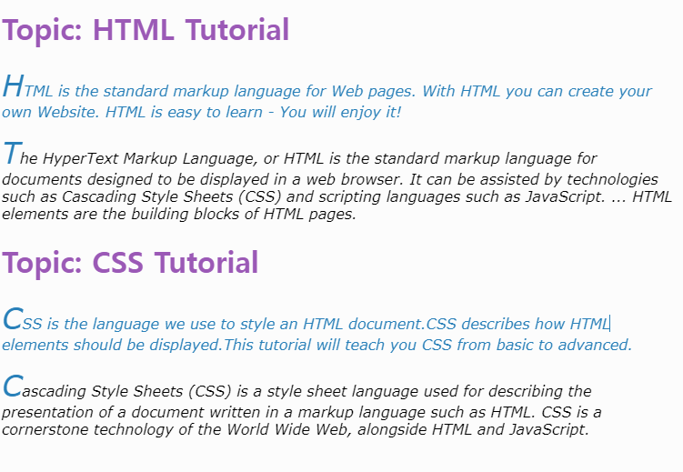

# 20220122(css & 선택자)

작성일시: 2022년 1월 22일 오전 9:11

# 오늘 배운것

css를 클래스를 이용해 html에 적용 할 수 있다.

예를 들어

**.red {} 로 앞에 .와 이름을 붙이면 클래스로 인식한다**. 그리고 이것을 html 로 불러 올때            <div class=”red”> </div> 이런 식으로 불러 올 수 있다. class의 장점은 특정 태그에 class를 선언해서 불러오면 된다. 그리고 class는 복수개의 css 를 받을 수 있다. class= “red box border” 이런식으로 띄어쓰기로 구분하면 다수의 클래스를 적용 시킬 수 있다.

또 다른 방법은 **div{} 이런식으로 태그 이름을 css로 설정해서 적용하는 것이다**. 좋은 점은 모은 태그에 적용된다는 것이고 단점 역시 모든 태그에 적용된다는 것이다.

```css
.sub-header {
    color: #2980b9; 
}

h1 {
    color:#9b59b6; // h1 모든 태그에 color 적용
}

h1::before {            // 모든 h1 태그에 시작부분에 Topic: 이란 내용을 넣는다.
  content: "Topic: ";  
}

p {                        // 모든 p 태그에 적용한다.
    font-size: 16px;
    font-style:italic;
    font-family:Verdana;
}

p::first-letter {          // 모든 p 태그 첫번째 글자에 적용한다.
  font-size: 200%;
  color:  #2980b9;
}

p:first-child {            //  p의 첫번째 자식에 적용한다. 
  text-align:center;
}
```

p:first-child {} 는 예를 들면

p의 부모로 div가 있다고 가정하면 div 자식중 첫번째 p에 css를 적용한다.



# 오늘 느낀점

css가 html에 어떤식으로 적용되는지 학습했다. 굉장히 쉬운 내용이지만 처음 이 내용을 모르고 css를 써본적이 있었던 기억이 나서 그런지 이런 기초들이 더욱 중요하게 느껴졌다. css가 html에 적용되는 구조를 알게되니 앞으로 css를 찾아서 활용하는데  좀 더 쉽고 수월해 질 것 같은 느낌이 든다.

# 참고 사이트

색깔 코드

[Flat UI Colors 2 - 14 Color Palettes, 280 colors 🎨](https://flatuicolors.com/palette/defo)

CSS 레퍼런스

[CSS ::first-letter Selector](https://www.w3schools.com/cssref/sel_firstletter.asp)

뒷배경 만들어주기

[CSS3 Patterns Gallery](http://projects.verou.me/css3patterns/)