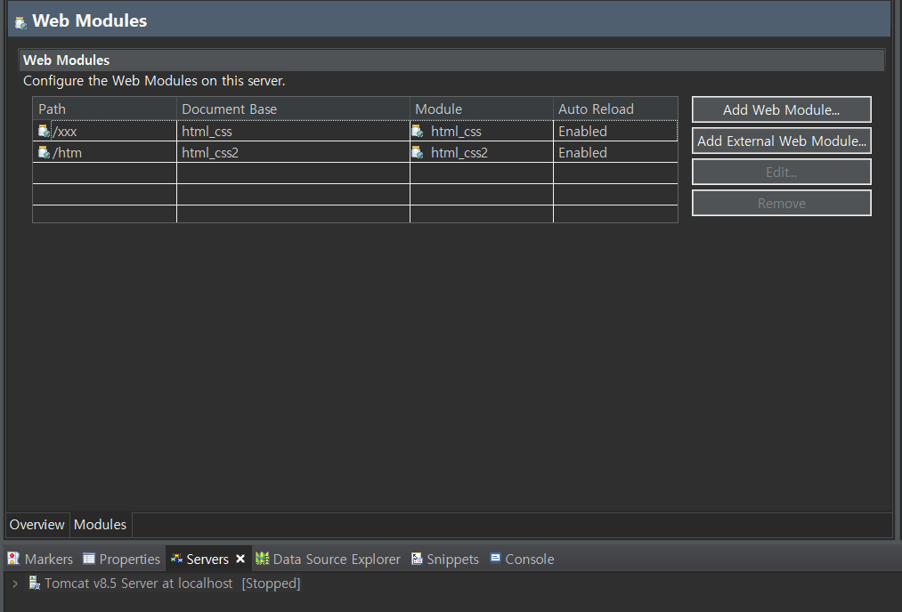

# 20220124(TOMCAT 개념 & 설정)

작성일시: 2022년 1월 24일 오전 11:12

# 오늘 배운것

## 톰캣 설정 하기

- TomCat 사이트에 접속해서 다운 받는다.

[Apache Tomcat®](https://tomcat.apache.org/)

- zip 파일 다운

- 알아서 풀기로 압축 해제

- 오른쪽 상단에 perspective 중 JAVAEE를 선택한다.

- servers에서 우클릭 New ⇒ Server 를 누른다.

- TomCat에 맞는 버젼을 선택해준다. 나는 8.5를 다운 받았기 때문에 8.5를 선택했다.
- 만들면 server에 뭐가 생기는데 더블클릭한다.

- use tomcat installation을 선택한다.
- deploy path는 톰캣 설치 폴더의 webapps를 선택한다.
    - webapps은 배포 폴더이다.
- 오라클 DB를 사용하고 있거나 중복 포트를 사용하는 경우 포트를 수정해준다.

## Dynamic Web Project 구성

TomCat의 WebApp에 접근하려면 Context명을 입력하면 된다.

Context가 실제주소인 WebApps에 맵핑하여 동작한다. 즉 Webapps / 경로   (X)

COntext명 / 경로 (O)

Dynamic Web Project 생성시 JavaResource 와 webContent 영역으로 나뉜다. WebContent 영역은 Html,Css(정적)등이 들어가고 JavaResource(동적)에는 java 파일이 들어간다. 

## Context 명 수정 방법

servers 에서 tomcat 서버를 더블 클릭하고 Modules 를 누르면 위와 같은 창이 나온다

이때 **Module 은 실제 주소 경로**, **Path는 Context 경로** 이다.