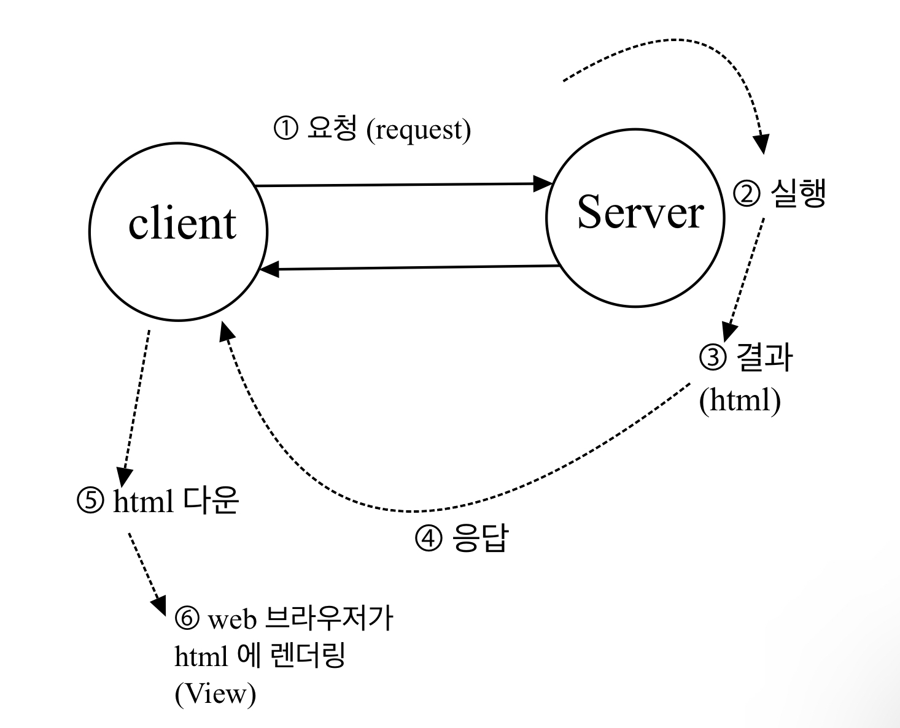
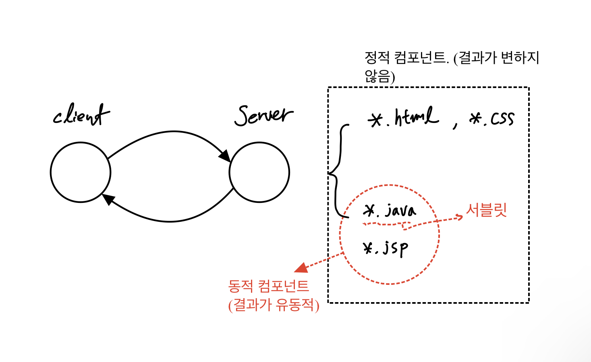
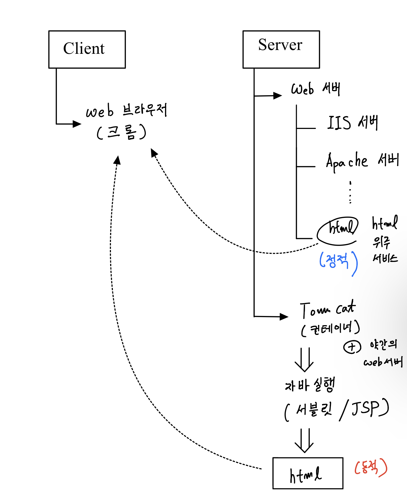
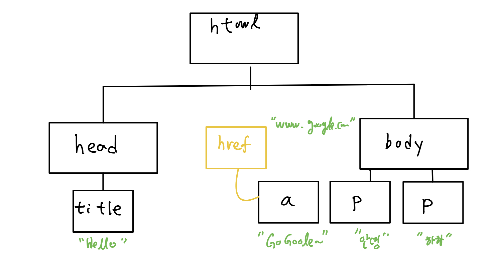

# 20220124(WEB의 기초)

작성일시: 2022년 1월 24일 오후 9:01

# 오늘 배운 것

## 웹의 기본적인 동작 그림



1. client는 사용자로부터 받은 명령을 서버에 요청한다. 이때 request는 URL를 이용한다.
    1. URL:      **IP/PORT번호/Context명/경로** 로 접근한다.
    2. 보통 클라이언트는 **브라우저**이다.(크롬, 파이어폭스,  엣지 등등......
2. 서버측에서 요청받은 값을 토대로 무엇인가 처리를 수행한다.
3. **결과값을 html**로 만든다.
4. 만든 html을 클라이언트로 넘긴다. 이것을 **Responce(응답)** 이라고 한다.
5. 클라이언트는 이 html을 다운받는다.
6. Web 브라우져가 html을 화면에 뿌린다.(rendering)

## 동적 컴포넌트 vs 정적 컴포넌트

- 동적 컴포넌트는 결과가 변경되서 출력 가능하다.
- 정적 컴포넌트는 정적으로 변경 될 수 없고 그대로 출력한다.



## Clinet - Side       VS        Server - Side

|  | Clint   Side | Server  Side |
| --- | --- | --- |
| 구성 | Web Browser | Web Server |
| 사용하는 언어 | JavaScript (Vue.js, React.js) | 서블릿/JSP, PHP, ASP  |
| 개발자 | 프론트엔드 | 백엔드 |

## 웹 아키텍처



## DOM(Document Object Model)

 문서를 자바스크립트 객체로 맵핑한 모델이라 생각하면 편하다.

```html
<html>
	<head>
		<title> Hello </title>
	</head>

	<body>
		<p> 안녕 </p>
		<p> 하하 </p>
		<a pref="www.google.com"> GoGoogle~~</a>
	</body>
</html>
```



**Dom Tree의 구성**

1. **element node** (태그 노드)
2. **Text node**(본체 값 노드)
3. **Attribute node**(시작 태그 속성)

# 오늘 느낀 점

- 강사님이 Request시 URL이 필요한데 URL이 웹에서 굉장히 중요한 요소라고 하셨다. URL의 구성은 IP /  PORT / Context / 경로로 이루어져있는데 여기서 신경이 쓰이는 부분은 PORT와 Context이다. PORT는 실제로 프로세스가 제공하는 데 충돌하지 않도록 설정해야 한다. 예를 들면 오라클 DB는 8080 포트를 제공한다. 그래서 우리가 TomCAT을 사용하기로 했다면 8080이 아닌 다른 포트를 사용해야 한다. Context는 논리적인 이름으로 실제 폴더 이름을  노출시키지 않도록 해준다. 보안상 이점이 있다.
- 커뮤니티 들어가면 서버사이드, 클라이언트 사이드 이런 말을 사용하는걸 많이 봤다. 근데 무슨 의미인지 모르고 뭔가 덜컥 무서운 단어였는데 사실 별 거 아니였다. 클라이언트 사이드는 클라이언트 단을 주로 개발하고 javascript를 사용한다. 그리고 이를 개발하는 개발자를 프론트엔드라 한다. 반대로 서버 사이드는 백엔드 개발자겠지?? 흠흠......