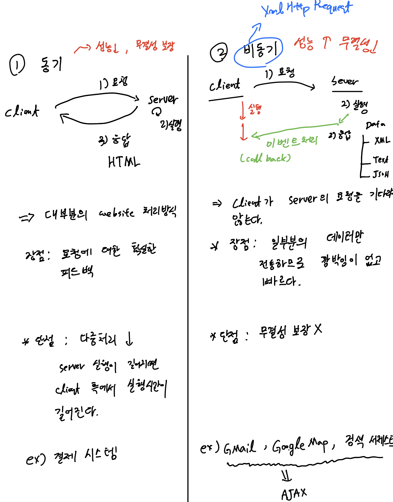

# 20220204(모듈, ajax)

작성일시: 2022년 2월 4일 오전 9:24

# 오늘 배운 것

## JS의 class

```jsx
class Person {
		constructor(name, age) {
			this.name = name;
			this.age = age;
		}
		setName(name) {
			this.name = name;
		}
		getName() {
			return this.name;
		}
		setAge(age) {
			this.age = age;
		}
		getAge() {
			return this.age;
		}
		
	}
	var p = new Person("이순신", 54);
```

JS 클래스는 멤버변수 선언 없이 함수로 호출하면 된다. 인스턴스 변수를 따로 명시 해 줄 필요 없다.

**constructor(name, age)**   를 이용해 생성자를 명시적으로 적어준다. 자바처럼 클래스 이름을 사용 하는 것이 아니라 꼭 constructor를 사용해주어야 한다.

```jsx
class Person {
	
		constructor(name, age) {
			this.name = name;
		}
		set setName(name) {
			this.name = name;
		}
		get getName() {
			return this.name;
		}
}
var p = new Person("이순신", 44);
// p.setName("홍길동"); // error
p.setName = "홍길동"; // 속성처럼 접근
console.log(p);
```

메서드명 앞에 **set, get**으로 명시해주면 **속성처럼 접근**한다.

```jsx
var xxx= "setName";

class Person {
	
	constructor(name, age) {
		this.name = name;
		this.age = age;
	}
	// 바인딩
	set [xxx](name) {
		this.name = name;
	}
	get getName() {
		return this.name;
	}
	setAge(age) {
		this.age = age;
	}
	getAge() {
		return this.age;
	}
}
```

메서드 에 [xxx] 하면 바인딩된다.

```jsx
//부모 클래스
	class Pet {
		constructor(name, age) {
			this.name =name;
			this.age = age;
		}
		info() {
			return this.name+" " + this.age;
		}
		
	}
	
	// 자식 클래스
	class Cat extends Pet {
		constructor(name, age, color) {
			super(name, age);
			this.color = color;
		}
		
		// override
		info() {
			return this.name+" " + this.age + " " + this.color;
		}
	}
	
	var c = new Cat("나비", 2, "블랙");
	console.log(c.info());
```

상속도 가능하다. 그러나 자바처럼 @ override를 통해 강제 할 수 없다. 에러를 뱉는 트릭을 만들 수 있긴 한데  부모 메서드가 예외를 던지면 된다. 그러나 이러면 부모의 메서드는 사용 할 수 없다. 뭔가 자바 처럼 완전한 느낌은 없다.

## 모듈

모듈은 보통 레이아웃별로 js를 분리해서 설계 할 때 많이 사용한다.  해당 모듈을 사용하려면 export를 통해 노출 시켜야 한다.

```jsx
// a.js
var num = 100;

function fun1() {
	console.log("fun1");
}

export {num, fun1} // export로 통으로 넘길 수 있다.
```

```jsx
// b.js
// 매 함수나 클래스 또는 변수 선언시 export를 선언하여 노출 할 수 있다.
export class Person() {
	
}

export function fun2() {
	console.log("fun2");
}
```

```jsx
//c.js

export default { // 하나만 노출 할 때 사용
	name:"홍길동",
	age:20
}
```

```jsx
//use.js

import {num, fun}    from './a.js';
import {Person, fun2}    from './b.js';
import kk from './c.js';
```

```html
<!--  호출방법1 -->
<!DOCTYPE html>
<html>
<head>
<meta charset="UTF-8">
<title>Insert title here</title>
<script type="module" src="use.js"></script>
</head>
<body>

	
</body>
</html>
```

```html
<!--  호출방법2 -->
<!DOCTYPE html>
<html>
<head>
<meta charset="UTF-8">
<title>Insert title here</title>
<script type="module" src="a.js"></script>
<script type="module">
	import {num, fun1} from './a.js';
	console.log(num);
	fun1();
	</script>
</head>
<body>

</body>
</html>
```

## ajax 원리

Aynchronous Javascript And XML 을 줄여서 ajax라 한다. 비동기 자바스크립트 data 통신 정도로 보면 될라나.... 서버에서 클라이언트로 데이터를 보낼 때 비동기 방식이 ajax이다. xml을 과거에 많이 사용했지만 지금은 json 으로 통신을 많이 한다.

## 동기 / 비동기



## AJAX 단점

cross Domain이 불가능하다. (같은 Domain에서만 AJAX 가능)

## ajax 예제1

javascript

```jsx
var httpRequest;
	function req() {
		httpRequest = new XMLHttpRequest();
		console.dir(httpRequest);
		
		// 요청시 응답을 처리하는 함수
		httpRequest.onreadystatechange=responseFun;
		httpRequest.open("get", "a.jsp",true);
		httpRequest.send(null); // get방식이면 null 지정
		
		
	}
	function responseFun() {
		// 성공 조건
		if(httpRequest.readyState== 4 && httpRequest.status==200) {
			var data = httpRequest.responseText;
			console.log(data);
		}
	}

```

## ajax 예제 2

```jsx
var httpRequest;
	function req() {
		httpRequest = new XMLHttpRequest();
		console.dir(httpRequest);
		
		// 요청시 응답을 처리하는 함수
		httpRequest.onreadystatechange=responseFun;
		httpRequest.open("get", "a2.jsp",true);
		httpRequest.send(null); // get방식이면 null 지정
		
		
	}
	function responseFun() {
		// 성공 조건
		if(httpRequest.readyState== 4 && httpRequest.status==200) {
			var data = httpRequest.responseText;
			var result = document.querySelector("#result");
			console.log(data);
			

	    	var json = JSON.parse(data);
	    	var html =`<ul>`;
	    	json.forEach(function(value,idx,arr){
	    		console.log(idx, value);
	    		     html+=`<li>${value}</li>`  
	    	});
	    	    html +=`</ul>`;
	    	document.querySelector("#result").innerHTML=html;

				
		}
	}
```

## ajax 예제3

```jsx
var httpRequest;
	function req() {
		httpRequest = new XMLHttpRequest();
		console.dir(httpRequest);
		
		// 요청시 응답을 처리하는 함수
		httpRequest.onreadystatechange=responseFun;
		httpRequest.open("get", "a4.jsp",true);
		httpRequest.send(null); // get방식이면 null 지정
		
		
	}
	function responseFun() {
		// 성공 조건
		if(httpRequest.readyState== 4 && httpRequest.status==200) {
			var data = httpRequest.responseText;
			var result = document.querySelector("#result");
			console.log(data);
			var jsons = JSON.parse(data);
			console.log(jsons, typeof jsons);
			var html = ``;
			html += `<table border="1">`;
			html += 
				`<tr>
					<th> 이름 </th>
					<th> 나이 </th>
					<th> 주소 </th>
				</tr>`;
			for(json of jsons) {
				html += 
					`<tr>
						<td>${json.username}</td>
						<td>${json.age}</td>
						<td>${json.address}</td>
					 </tr>`;
			}
			html += `</table>`;
			result.innerHTML = html;
			
		}
```

jsp

```
<%@ page language="java" contentType="text/html; charset=UTF-8"
    pageEncoding="UTF-8"%>
홍길동
```

## ajax 예제4

```jsx
var httpRequest;
	function req() {
		httpRequest = new XMLHttpRequest();
		console.dir(httpRequest);
		
		// 요청시 응답을 처리하는 함수
		httpRequest.onreadystatechange=responseFun;
		httpRequest.open("get", "a5.jsp",true);
		httpRequest.send(null); // get방식이면 null 지정
		
		
	}
	function responseFun() {
		// 성공 조건
		if(httpRequest.readyState== 4 && httpRequest.status==200) {
			var data = httpRequest.responseXML;
			var result = document.querySelector("#result");
			var name = data.querySelector("#x").innerHTML;
			var age = data.querySelector("#y").innerHTML;
			var address = data.querySelector("#z").innerHTML;
			
			console.log(name, age, address);
		}
	}
```

# 오늘 느낀점

- 백엔드와 프론트엔드 간의 긴밀한 개념인 AJAX에 대해 배웠다. 아직 기본맛만 맛보긴 했지만 CORS, SOP에 대해 따로 정리해 둬야 겠다는 생각이 들었다.’

# 링크

AJAX를 완전히 이해하려면 CORS를 이해해야 한다.

[교차 출처 리소스 공유 (CORS) - HTTP | MDN](https://developer.mozilla.org/ko/docs/Web/HTTP/CORS)

[https://www.youtube.com/watch?v=-2TgkKYmJt4](https://www.youtube.com/watch?v=-2TgkKYmJt4)