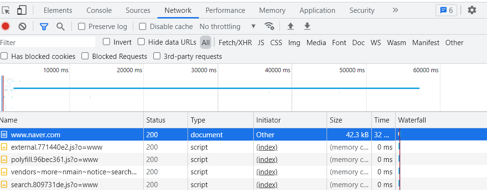
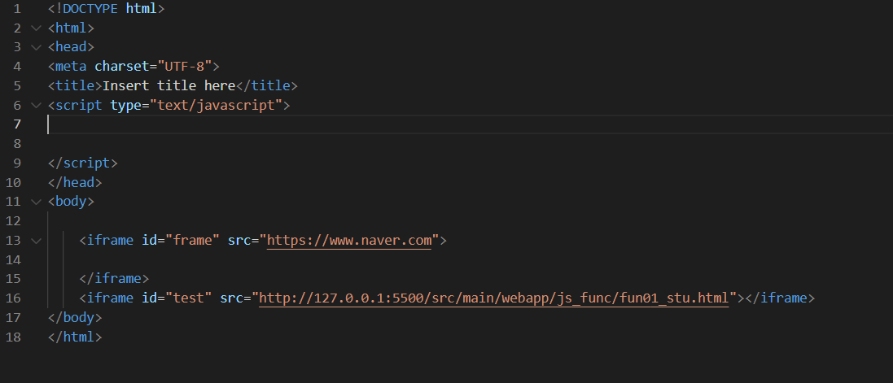
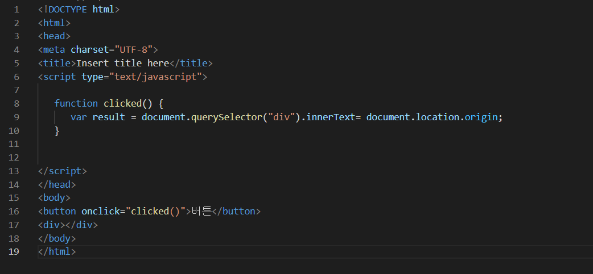
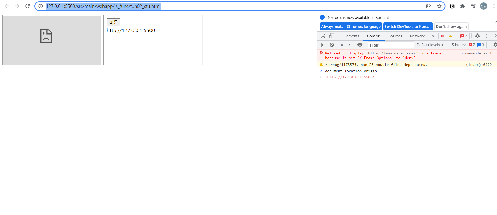
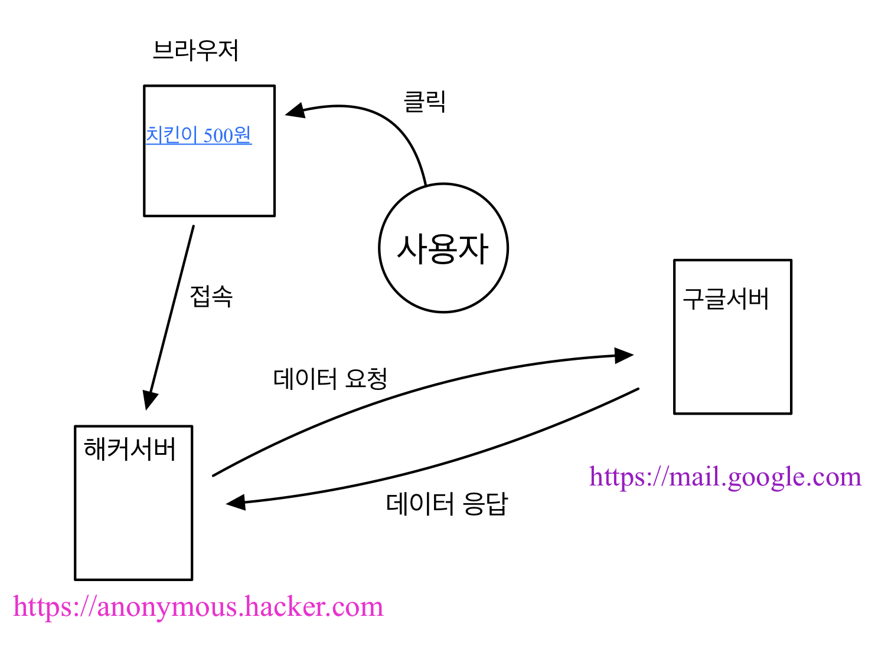
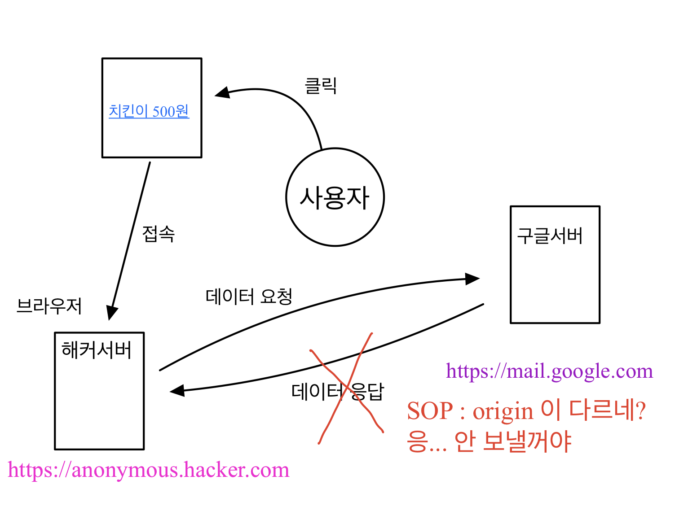

# 20220206(SOP,CORS)

작성일시: 2022년 2월 6일 오후 6:39

# 오늘 배운것

## Origin

- 브라우저가 접속 해서 document를 받을 때 출신을 적어 놓는데 이를 Origin이라고 한다.

- ex) Origin ⇒ https://www.helloworld.com:5500/hello/a.html 이런 url이 있다고 가정하면 https://www.helloworld.com:5500 까지가 origin이다. 뒷부분 경로는 다르더라도 port까지 일치하면 같은 Origin으로 판단한다.

그림1

http://127.0.0.1:5500/src/main/webapp/js_func/fun02_stu.html 의 html 코드이다.

그림2

http://127.0.0.1:5500/src/main/webapp/js_func/fun01_stu.html 의 html 코드이다.

위 두 코드를 해석하면 fun01_stu.html은 버튼을 누르면 본인의 Origin을 호출하고 func02_stu iframe에서 확인하는 코드이다.

그림3

2 개의 origin을 살펴보면 동일 한 것을 알 수 있다.

## SOP

- SOP는 Same Origin Policy를 줄인 말로 직역하면 같은 Origin 정책이라고 한다.
- 한 Origin으로 부터 로드된 document 또는 Script가 다른 origin의 자원과 상호작용 할 수 있는 방법을 제한하는 보안 메커니즘.

 위에 브라우저 그림을 보면 https://www.naver.com 은 iframe으로 불러오지 못한 것을 알 수 있다. Origin이 일치하지 않기 때문이다. 그리고 Origin에 대해서 설명 할때 iframe을 불러 올 수 있는 이유는 Origin이 일치 했기 때문이다. 실제로 document.location.origin 을 찍어서 비교했을 때도 같았다. SOP를 쓰는 이유는 무엇일까? 보안 때문이다.

 다음은 해커와 사용자 그리고 서버간에 시뮬레이션을 통해 SOP의 필요성에 대해서 이해해보자

SOP 정책이 없다면 정말 해킹이 쉽게 일어 날 수 있다. 먼저 사용자가 치킨 500원이라는 내용에 혹해서 링크를 클릭했다고 가정하자. 그러면 그 링크를 통해 사용자의 브라우저는 해커서버 도메인으로 이동한다. 그럼 브라우저는 우선 해커서버로 부터 document를 다운받아서 렌더링을 한다. 이때 해커 도메인이 구글서버에 자동으로 데이터를 요청하는 스크립트를 작성했다고 가정하면 해커는 쉽게 사용자의 정보를 구글로부터 얻어 올 수 있다.

 그러나 SOP 정책에 따라 해커 도메인에서 쉽게 구글서버로부터 데이터 응답을 받을 수 없다. 왜냐하면 현재 접속해있는 해커 도메인에서 데이터 요청을 하면 구글 서버에서는 SOP 정책에 따라 origin을 비교한다. 서로 아예 다른 Origin을 가지고 있기때문에 요청을 해도  데이터 응답을 허용하지 않는다. 보안이 강화된다고 볼 수 있다.

## CORS

- cross-origin: 서로 다른 origin
- same-origin: 같은 origin

 SOP는 해커와 시뮬레이션을 통해 필요한 정책임을 알게 되었다. 그러나 개발하다보면 다른 서버의 리소스를 끌어와 써야 할 때가 있다. 즉 Cross-origin일 때 어떻게 하면 정보를 얻어 올 수 있을까..?

 바로 허용할 origin을  Access-Control-Allow-Origin 에 추가하면 된다. 쉽게 설명하면 방화벽 설정 할 때 예외를 두는 것과 비슷하게 생각하면 될 것 같다. 이것이 CORS 의 역할이다.

CORS 접근 제어 시나리오는 3가지가 있다.

- 단순 요청(Simple Request)
- 프리플라이트 요청(Preflight Request)
- 인증정보 포함요청(Credentialed Request)

# 오늘 느낀점

- 프론트엔드와 백엔드 협업시 CORS, SOP 관련 에러가 가끔 발생한다고 한다. Acess-Control-Allow-Origin에 관련된 에러가 발생한다면 CORS에 대해서 생각해 봐야 한다고 생각한다.
- 아직 실제로 프로젝트를 해보지 않아서 어떤 문제인지 감은 안 잡히지만 CORS와 SOP를 통해 웹이 해커로 부터 어떻게 데이터를 보호하는지 알게 되었고 협업시에도 이런 문제가 발생 할 수 있구나 하는 사실을 알게 되었다. 조만간 COR 접근 제어 시나리오 중 preflight Request에 대해 공부해 봐야겠다.

# 참고

[https://www.youtube.com/watch?v=6QV_JpabO7g](https://www.youtube.com/watch?v=6QV_JpabO7g)