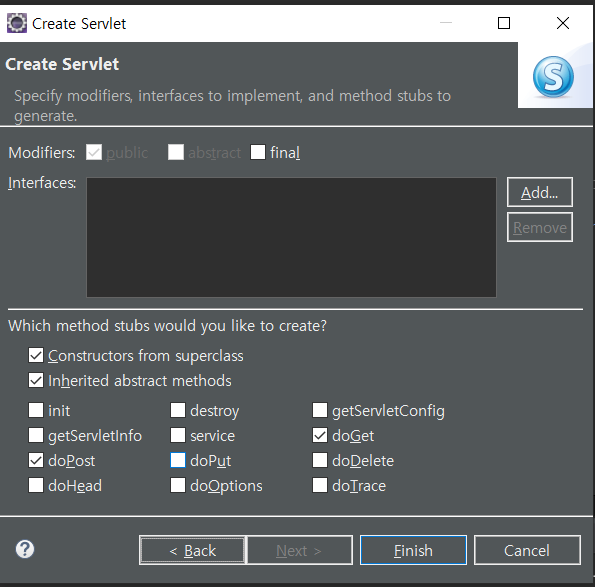

# 20220207(서블릿)

작성일시: 2022년 2월 7일 오전 8:42

# 오늘 배운 것

## 서블릿

- 동적 컴포넌트를 관리, 역
- JSP와 서블릿의 차이점은 JSP는 html위주에 약간에 자바를 포함하고 있고 뷰 위주이다. 반면에 서블릿은 로직위주이고 주로 응답할 때 html로 출력한다.
- **반드시 패키지를 사용해야 한다**.
- HttpServlet 을 상속 받는다.
- doGet 과 doPost를 이용해 데이터를 받는다.
- 서블릿 mapping을 해준다. (2가지 방법이 있다.)
    - web.xml에 등록하는 방법
    - @webservlet 어노테이션을 이용하는 방법
- tomcat에 서블릿 등록
    - tomcat에 서블릿 등록과 매핑은 보통 동시에 일어난다.
    - 서블릿 매핑을 하는 이유는 보안상 이유와 긴 URL을 줄이기 위해.
- 서블릿은 내부적으로 싱글턴 패턴을 따른다.
    - 그래서 인스변수를 선언하면 서로 다른 클라이언트끼리 변수를 공유해서 사용 할 수 있다.
    - 변수를 공유하지 않으려면 메서드안에서 로컬변수를 사용하면 된다.
    - 서버 실행시 한번의 생성만 일어나며 나머지는 클라이언트가 서로 공유하며 변수를 사용한다. 서버 종료시 혹은 서블릿 소스를 변경하는 경우 소멸이 일어난다.

## WEB 컴포넌트

  웹 컴포넌트는 그 기능을 나머지 코드로부터 캡슐화하여 재사용 가능한 커스텀 엘리먼트를 생성하고 웹 앱에서 활용할 수 있도록 해주는 다양한 기술들의 모음입니다.

1. html 컴포넌트 ⇒ 정적 컴포넌트
2. JSP 컴포넌트   ⇒  동적 컴포넌트
3. servlet             ⇒ 동적 컴포넌트

## URL을 통해 서블릿 접근 방법

ex) http://서버IP:port 번호/**context명**/**servlet**/**com.servlet**.HelloServlet

서블릿에 접근 할 때는 context 다음 서블릿을 명시해주고 패키지이름 다음 서블릿 클래스을 입력해주면 된다. 그러나 너무 길기 때문에 별칭을 보통 사용하는데 별칭을 사용하면 다음과 같이 줄일 수 있다.

ex) http://서버IP:port 번호/**context명/hello**

## 서블릿 요청 처리

## 서블릿 응답처리

1. MIME 타입지정 response.setContentType
2. 출력 API PrintWriter out = response.getWriter()

# 이클립스 웹 서블릿 만드는 방법

다이나믹 웹 프로젝트 위로 커서를 올린후 우클릭하고 new를 누르면 servlet 생성이 보인다.

패키지와 클래스이름을 입력하고 next를 누른다.

서블릿 매핑이름을 바꾸고 싶으면 edit으로 바꿀 수 있다.

목적에 따라 선택후 Finish를 누르면 된다.

최종 모습

맨 위에 패키지가 정의되어 있고 어노테이션에 서블릿매핑이 되어있다.

doGet, doPost는 클라이언트 요청 방식에 따라 반응하는 서블렛 메서드이다.

httpServlet을 상속 받음을 알 수 있다.

HttpServletRequest와 HttpServletResponse를 이용해 요청 응답을 처리한다.

# 오늘 느낀점

- 막상 보면 어려운 개념은 아니다. 그러나 하나하나 기본을 잘 알아놔야 할 것 같다. 기본적으로 서블릿은 동적 html을 뿌려 줄 수 있고 싱글턴 패턴이다. 그리고 request, response를 통해 쉽게 동접 웹을 제공 할 수 있다.