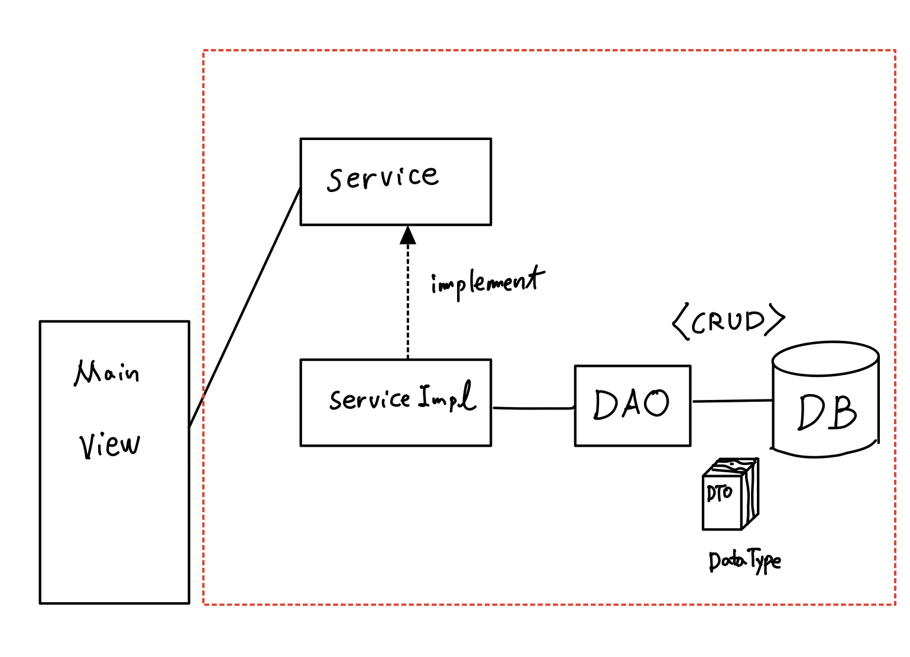
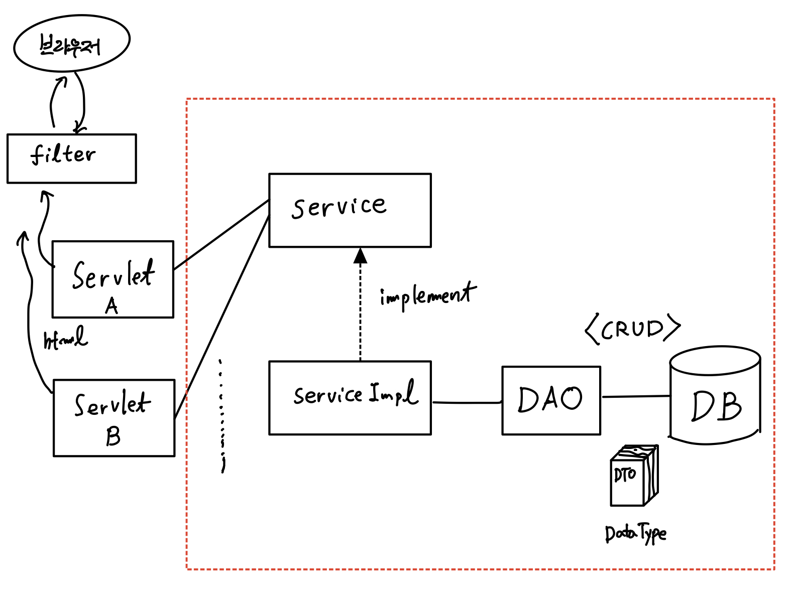
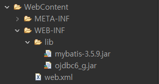

# 20220211(서블릿과 DB 연동)

작성일시: 2022년 2월 11일 오전 7:14

# 오늘 배운것

# MyBatis와 서블릿 구조

앱에서와 웹에서 DB연동은 거의 같다. DB를 호출해서 실행하는 메인의 차이만 있을 뿐....

그림을 보면 이해하기 쉽다.

**일반 앱 DB 연동**



**서블릿과 DB 연동**



## 이클립스 서블릿 DB 연동

1. 우선 다이나믹 웹 프로젝트를 생성한다.
2. 그 이후 lib에 mybatis와 오라클 driver  jar 파일을 넣어준다.
    1. 웹에서는 lib에서만 외부 라이브러리를 인식한다.
    
    
    

3. config에 Mybatis를 연동하기 위한 xml과 properties를 만들어준다.
    
    **Configuration.xml**
    
    ```xml
    <configuration>
    
      <!-- xml 주석 -->	
      <!-- jdbc.properties 등록 -->
      <properties resource="com/config/jdbc.properties"></properties>
      <!-- DTO에 별칭 -->
      <typeAliases>
        <typeAlias type="com.dto.Student" alias="Student"/>
      </typeAliases>
      	
      <environments default="development">
        <environment id="development">
          <transactionManager type="JDBC"/>
          <dataSource type="POOLED">
            <property name="driver" value="${jdbc.oracle}"/>
            <property name="url" value="${jdbc.url}"/>
            <property name="username" value="${jdbc.userid}"/>
            <property name="password" value="${jdbc.passwd}"/>
          </dataSource>
        </environment>
      </environments>
      <mappers>
    		<!-- mapper파일 경로 -->
        <mapper resource="com/config/StudentMapper.xml"/>
      </mappers>
    </configuration>
    ```
    

**jdbc.properties**

```
jdbc.oracle=oracle.jdbc.driver.OracleDriver
jdbc.url=jdbc:oracle:thin:@localhost:1521:xe
jdbc.userid=workshop
jdbc.passwd=workshop
```

**StudentMapper.xml**

```xml
<mapper namespace="com.config.StudentMapper">
	<select id="selectAll" resultType="Student">

	   select student_no "studentNo",
       department_no "departmentNo",
       student_name as "studentName",
       substr(student_ssn,0, 8) || '******' as "studentSsn",
       substr(student_address,0, 10) || '...' as "studentAddress",
       to_char(entrance_date, 'YYYY/MM/DD') as "entranceDate",
       absence_yn as "absenceYn",
       coach_professor_no as "coachProfessorNo"
		from tb_student
		order by 1

	</select>

</mapper>
```

1. dto,dao,service를 만든다.
    
    SessionFactory 싱글톤 패턴, dao에서 mapper.xml의 sql문을 호출하기 위한 클래스
    

```java
package com.service;

import java.io.IOException;
import java.io.InputStream;

import org.apache.ibatis.io.Resources;
import org.apache.ibatis.session.SqlSession;
import org.apache.ibatis.session.SqlSessionFactory;
import org.apache.ibatis.session.SqlSessionFactoryBuilder;

public class MySqlSessionFactory {
    static SqlSessionFactory sqlSessionFactory;
	static {
		String resource = "com/config/Configuration.xml";
		InputStream inputStream=null;
		try {
			inputStream = Resources.getResourceAsStream(resource);
		} catch (IOException e) {
			e.printStackTrace();
		}
		  sqlSessionFactory =
		  new SqlSessionFactoryBuilder().build(inputStream);
	}//end static 블럭
	
	public static SqlSession getSession() {
		return sqlSessionFactory.openSession();
	}
}
```

1. 서블릿에서 service 클래스를 이용해 DB내용을 호출한다.

```java
StudentService service = new StudentServiceImpl();
List<Student> list = service.pagingAll();
List<List<Student>> splittedData = splitData(list, 3);
```

# 오늘 느낀점

- 크게 어려운 내용은 없다. 그러나 DB 연동은 오류가 많이 일어날 가능성이 있기 때문에 천천히 꼼꼼히 체크하면서 프로젝트를 만드는게 좋다.  특히 SQL ,DTO, DAO 사이에서 오류가 많이 일어난다.