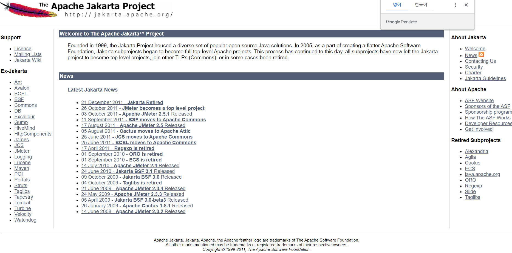
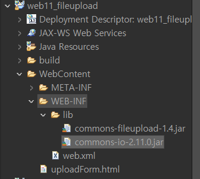

# 20220214(FileUpload)

작성일시: 2022년 2월 14일 오전 2:35

# 오늘 배우는 것

## 파일 업로드를 위한 라이브러리 다운 받기



아파치 자카르타 프로젝트 접속


IO 접속 


라이브러리 다운로드


FileUpload 접속


Binary 라이브러리 다운로드


그 이외 디테일한 것은 userGuide에서 참고하면 된다.

## 이클립스에서 파일 업로드 사용 방법



동적 웹 프로젝트에서 라이브러리를 이용하려면 WebContent → WEB-INF → lib 에다가 저장한다.

```html
<form method="POST" enctype="multipart/form-data" action="UploadServlet">
파일<input type="file" name="theFile"><br>
커맨드 <input type="text" name="theText"><br>
<input type="submit" value="업로드">
```

**Html**

```java
@Override
	protected void doPost(HttpServletRequest request, HttpServletResponse response) throws ServletException, IOException {
		// Create a factory for disk-based file items
		DiskFileItemFactory factory = new DiskFileItemFactory();

		// Configure a repository (to ensure a secure temp location is used)
		ServletContext servletContext = this.getServletConfig().getServletContext();
		File repository = (File) servletContext.getAttribute("javax.servlet.context.tempdir");
		factory.setRepository(repository);

		// Create a new file upload handler
		ServletFileUpload upload = new ServletFileUpload(factory);
		
		//한 건당 크기 지정(5M)
		upload.setFileSizeMax(1024*1024*5);
		// 전체 크기 지정(10M)
		upload.setSizeMax(1024*1024*10);
		
		// Parse the request
		try {
			List<FileItem> items = upload.parseRequest(request);
			
			// Process the uploaded items
			Iterator<FileItem> iter = items.iterator();
			
			String fieldName="";
			String fileName="";
			String contentType="";
			boolean isInMemory = false;
			long sizeInBytes = 0;
			while (iter.hasNext()) {
			    FileItem item = iter.next();

			    if (item.isFormField()) {
			    	// type="file"이 아닌 사용자 입력 데이터 처리
			    	/*
			    	 * String comment = request.getParameter("theText") 쓰지마셈.
			    	 * 
			    	 */
			    	String name = item.getFieldName();
			    	String value = item.getString("utf-8");
			    	System.out.println(name+"\t"+value);
			        
			    } else {
			    	//type="file"인 사용자 입력 데이터 처리
			        fieldName = item.getFieldName();
			        fileName = item.getName();
			        contentType = item.getContentType();
			        isInMemory = item.isInMemory();
			        sizeInBytes = item.getSize();
			        System.out.println(fileName+"\t"+contentType+"\t"+sizeInBytes);
			    }
			    
			    File uploadedFile = new File("C:\\upload", fileName); // 실제 서버 저장 경로
			    
			    try {
					item.write(uploadedFile);
				} catch (Exception e) {
					// TODO Auto-generated catch block
					e.printStackTrace();
				}
			} // end while
			
			// 응답처리
			response.setContentType("text/html;charset=utf-8");
			PrintWriter out = response.getWriter();
			out.print("<html><body>");
//			out.print("작성자:" + value+"<br>");
			out.print("파일크기:" + sizeInBytes+"<br>");
			out.print("파일타입:" + contentType+"<br>");
			out.print("파일명:" + fileName+"<br>");
			out.print("</body></html>");

			
		} catch (FileUploadException e) {
			// TODO Auto-generated catch block
			e.printStackTrace();
		}
	}
```

**Servlet** 

# 오늘 배운점

- 파일 업로드는 복붙 할께 많다 API 문서 찾아보고 정리하는 법을 익히자