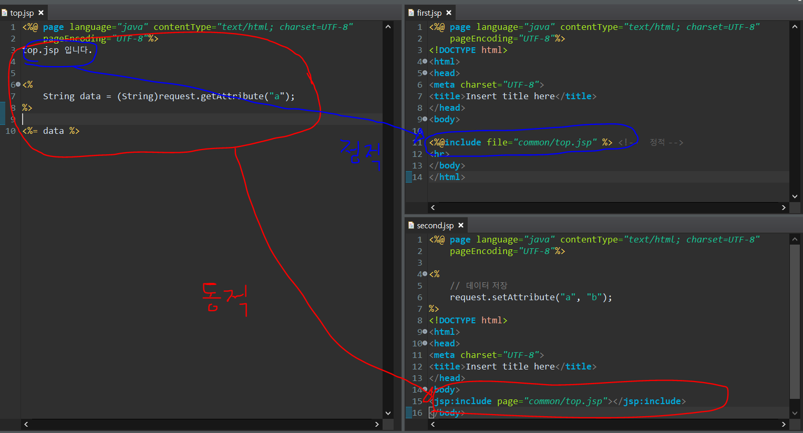
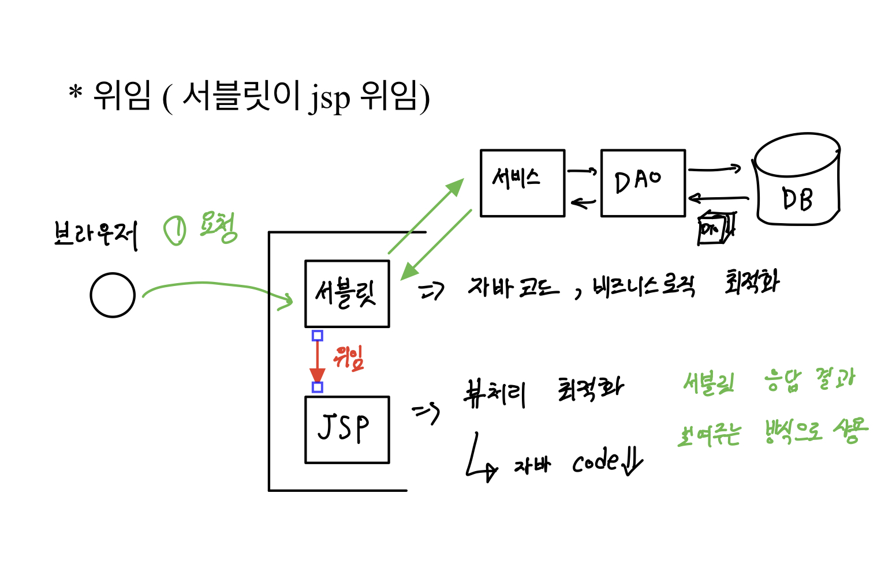
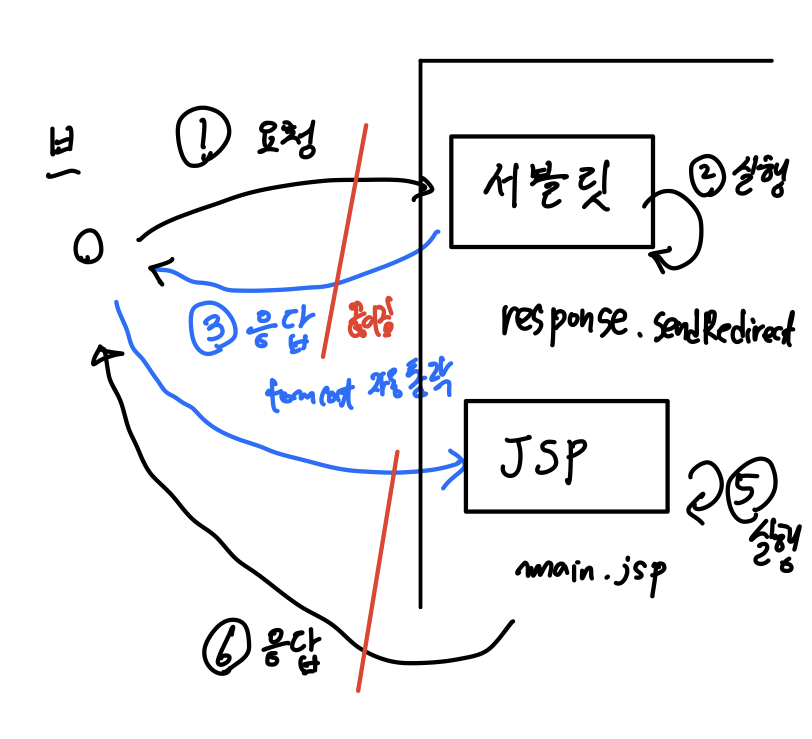
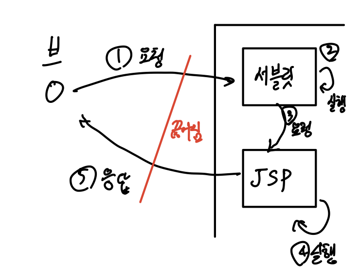

# (20220214)JSP

작성일시: 2022년 2월 14일 오전 10:21

# 오늘 배운 것

## JSP 구성요소

1. JSP는 기본적으로 tag로 구성
2. HTML 태그
    1. directive tage
        1. <%@ page %>
        2. <%@ include %>
        3. <%@ taglib %>
    2. declaration tag -<%! %>
    3. scriptlet tag = <% %>
        1. 서블릿 doGet/doPost 핵심 코드
        2. 내장객체(내장 변수) 사용 가능
    4. event tag <%= 변수(브라우저 출력)  %>
3. 액션 태그
    1. 주로 JSP로만 개발 할 때 쓰임(Model1)
        1. Model1은 현재 현업에서 잘 쓰이는 모델이 아님
        2. <jsp:0 />
        3. <jsp:include page=”파일명” />
4. EL 태그
    1. Expression Language
    2. ${ key 값}
5. JSTL(JSP standard Tag Library)
    1. 등장배경: jsp 화면에서 java 코드 제거 목적
    2. 사용 예 ex) <c:if>   <c:foreach>

## JSP include 기능

화면 재사용을 위해 사용한다. 보통 모듈화 한 후 jsp에 링크하는 형식으로 사용한다.

### 정적 방식     <%include file=”top.jsp”%>

### 동적 방식     <jsp:include page=”top.jsp” flush=”true”>

### 동적 방식

정적 방식은 스크립트 태그 값을 가져 올 수 없다. 그 이유는 jsp를 그냥 그대로 링크해서 가져오기 때문

동적 방식은 가져 올 수 있다. 요청시 컴파일을 해서 .class로 제공하기 때문..

## 서블릿 JSP 위임 방식

로직과 뷰를 나누는 방법이다. 로직은 서블릿!!!, 뷰는 JSP!!!

### 위임 방법 2가지

1. 포워드(forward) ⇒ httpServletRequest 이용
    1. **request.getRequestDispatcher(”target.jsp”).forward(request, response);**
2. 리다이렉트(redirect)  ⇒ HttpServletResponse 이용
    1. **response.sedRedirect(”target.jsp”);**

### 리다이렉트

서블릿 로직 실행후 sendRedirect 메서드를 실행하면 톰캣에서 자동적으로 브라우저에 응답하고 jsp를 호출한다. 이때 URL이 바뀌고 request를 끊고 재 요청하기 떄문에 request의 데이터를 jsp와 공유 할 수 없다.

### 포워드

서블릿 로직 실행 후 JSP에 직접 요청한다. URL은 변경되지 않고 Request는 여전히  존재하고 있기 때문에 서블릿, JSP간 Request의 데이터를 공유 가능하다 그리고 응답시 request는 끊어진다.

# 오늘 느낀점

- Servlet 위임은 매우 중요하다. 그 이유는 Servlet 위임은 MVC 패턴의 기초가 되기 때문이다.
- MVC 패턴에서 Servlet은 컨트롤러 역할을 한다. Servlet은 모델부분과 뷰 부분을 연결 한다.  모델은 서비스부터 DAO를 거쳐 DB까지 부분을 의미하고 View는 JSP를 의미한다.  Servlet위임을 사용하면 직접 jsp를 열고 닫는 것이 아니라 서블릿에서 리다이렉트나 포워드 방식을 이용해서 한다.
- 앞으로 배울 내용이긴 하지만 리다이렉트와 포워드는 멱등 조건에 따라 용도가 달라진다. 다음시간에 게시판 만들기를 하는데 그 때 설계와 함께 리다이렉트와 포워드를 배우려고 한다.