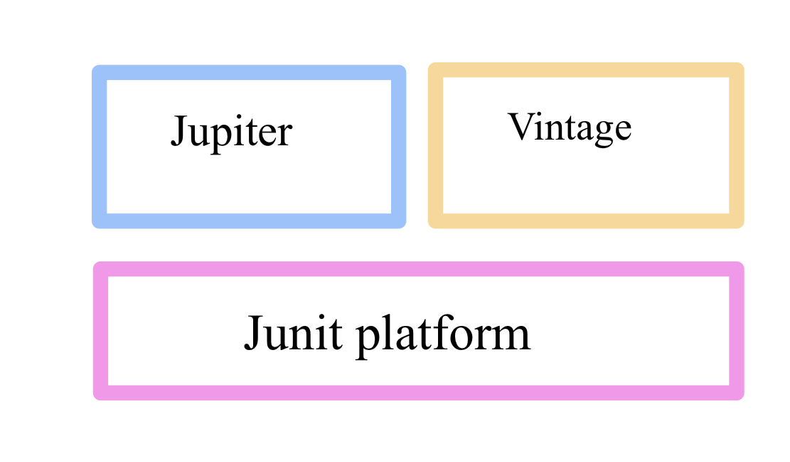

# 20220218(Junit5)

작성일시: 2022년 2월 18일 오후 4:53

# 오늘 배운것

## Junit5

Junit5은 라이브러리를 가져와 쓰는 구조가 아닌 자체 모듈을 제공한다. 모듈을 통해 직접 테스트를 돌릴 수 있다.



**Junit Platform** : JVM에서 테스트 프레임워크를 실행하기 위한 기반 역할을 수행한다. testEngine API 제공

**Junit Jupiter :** Junit5의 테스트 및 확장을 작성하기 위한 새로운 프레임워크

**Junit Vintage :** JUnit3, 4를 기반 테스트에 실행하기 위한 프레임 워크

## Annotation

### BeforeAll

```java
// 모든 테스트 실행 전 단 한번만 실행.
@BeforeAll
static void testBeforeAll() {
	System.out.println("beforeAll");
	
}
```

모든 테스트 전에 단 한번만 실행 된다. static으로 정의 되어있는데 쉽게 이야기하면 JUnit 클래스 테스트 시작시 바로 시작하는 코드로 볼 수 있다. 초기 init 또는 parameter 로 설정해 쓰는 경우가 많다.

### **AfterAll**

```java
// 모든 데스트 실행 후 단 한번만 실행.
@AfterAll
static void testAfterAll() {
	System.out.println("afterAll");
}
```

모든 테스트 후에 한번만 실행 된다. 예를 들면 반드시 무언가를 종료시켜야 할 때 사용 할 수 있을 것 같다.

### **BeforeEach**

```java
// 각 Test 실행 전마다 실행
	@BeforeEach
	void testBeforeEach() {
		System.out.println("beforeEach");
	}
```

각 test 실행 전에 한 번 실행된다.

### **AfterEach**

```java
// 각 Test 실행 후마다 실행
	@AfterEach
	void testAfterEach() {
		System.out.println("afterEach");
	}
```

각 test 실행 후에 한 번 실행된다.

### **DisplayName**

```java
@Test
@DisplayName("테스트1") // displayName
void test1() {
	System.out.println("test1");
}
```

DisplayName을 설정하면 junit 실행시 편한 네이밍으로 직관적으로 테스트 할 수 있다.


### RepeatedTest

```java
@RepeatedTest(value=10, name="{displayName} 중 {currentRepetition} of {totalRepetitions}")
void test3() {
	System.out.println("반복 테스트");
}
```

RepeatedTest는 반복해서 실행하고 테스트한다.  특별한 일 없는데 코드를 실행 시 성능 이슈가 있는 경우 이런 코드를 사용 해 볼 수 있다.

value= 은 총 반복 할 횟수 설정

{displayName}은 디스플레이네임 

{currentRepetition}은 현재 반복이 몇 번째 일어나는지 표시

{totalRepetition}은 총 반복 할 횟수 표시

### **ParameterizedTest**

```java
**@ParameterizedTest
@ValueSource(ints= {1,3,5,-1,2,Integer.MAX_VALUE})
void isOdd(int number) {
	assertTrue(number % 2 == 0);
}**
```

**ValueSource**와 함께 사용한다. **ParameterizedTest**는 여럿 파라미터를 주어 코드를 테스트한다.  이것을 사용하면 여럿 테스트를 input case 별로 만들 필요 없이 쉽게 사용 가능하다. 

## Assertions

사전적인 의미로는 주장, 행사 라는 뜻을 가지고 있다.

위키 백과에 살펴보면 Assertions은 디버깅시 버그를 파악하기 위해 사용하는 매크로라고 한다. 

junit jupiter Assertions는 모두 static 메서드이다.

### assertAll

```java
class Assertions {

	@Test
	void test1() {
		int a = 10;
		int b = 20;
		int c = a+ b;
		int d = a * b;
		assertEquals(20, c);
		assertEquals(200, d);
	}

	@Test
	void test2() {
		int a = 10;
		int b = 20;
		int c = a+ b;
		int d = a * b;
		assertAll(
				()->assertEquals(20, c),
				()->assertEquals(200, d)
				);
		
	}

}
```

매개 변수로 받는 모든 테스트 코드를 한번에 실행한다. 테스트 코드는 람다 함수를 활용해서 AssertAll에 순차적으로 기입하면 된다.

### assertThrows(expectedType, executable)

예외 발생을 확인하는 테스트

executable의 로직이 실행하는 도중 expectedType의 에러를 발생시키는지 확인

### **assertTimeout(duration, executable)**

타임아웃을 체크한다. 특정 메서드 실행이나 클래스 생성, 해제와 같은 부분에서 오버헤드를 찍어 볼 수 있고 executable이기 때문에 좀 더 유연하게 테스트가 가능하다. 

```java
@Test
void test3() {
assertTimeout(Duration.ofMillis(100), ()->{
	Thread.sleep(400);
});
}
```

TimeOut이 나는 코드이다.  위 코드가 timeout 나는 이유는 TimeOut 제한으로 100 millis를 주었지만 Thread는 400 ms 동안 동작하지 않게 만들었기 때문이다.

# 오늘 느낀점

# 참고

[https://www.youtube.com/watch?v=EwI3E9Natcw&list=RDCMUC-mOekGSesms0agFntnQang&start_radio=1&rv=EwI3E9Natcw&t=632](https://www.youtube.com/watch?v=EwI3E9Natcw&list=RDCMUC-mOekGSesms0agFntnQang&start_radio=1&rv=EwI3E9Natcw&t=632)