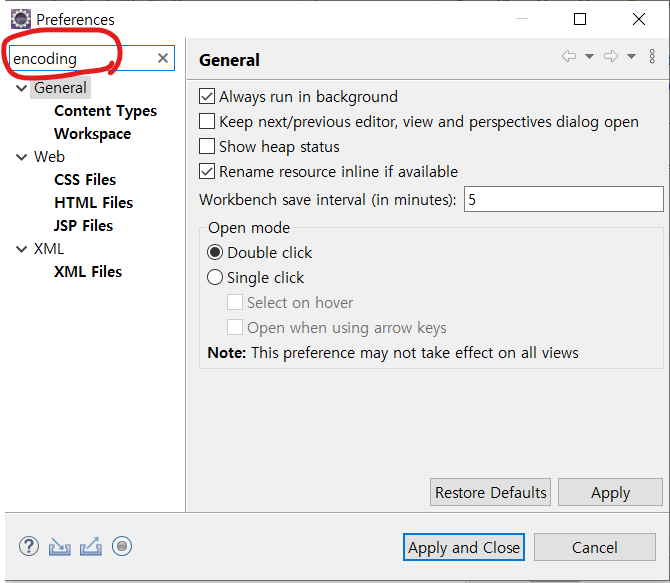

# 20220222(이클립스인코딩UTF-8설정)

작성일시: 2022년 2월 22일 오후 10:44

# 오늘 배운 것

## 한글 깨짐 현상

새로운 폴더 작업 환경에서 작업하면 인코딩 환경 때문에 한글이 깨진다. 그래서 환경을 모두 UTF-8로 바꾸어 주어야 한다. 

## 모두 UTF8로 인코딩 해주기

Windows → Preferences 에 접속해준다.

Preference 밑에 검색란에 **encoding** 을 입력해준다.

text를 누른 후 밑에 Default encoding: 에 UTF-8을 써준다.

workspace를 누른 뒤 other에서 UTF-8을 입력해준다.

css, html, jsp file 모두 encoding을 utf-8로 설정해준다.

# 오늘 배운 것

- 작업 환경 세팅은 중요한 것 같다. 한글 깨짐 때문에 불편했는데 이렇게 인코딩을 설정하면 한글 깨짐을 예방 할 수 있다.